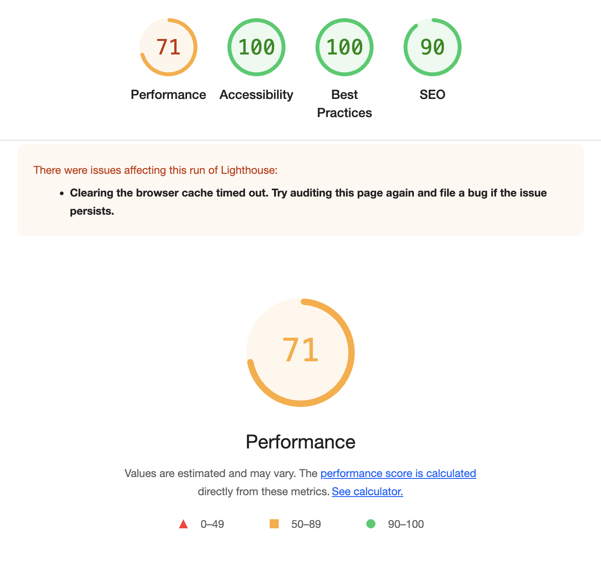

# Real-time Chat Application: Architecture & Technical Decisions

## Overview 🌐

This document outlines the architecture, technical decisions, and implementation details of the real-time chat application, which allows multiple users to join a single chat room, exchange real-time messages, see typing indicators, and access message history when they join.

This project showcases not only the implementation of a real-time chat, but also demonstrates awareness of best practices in modern web development, including security, accessibility, and scalability considerations.

The choices made in this project represent a balance between simplicity (appropriate for time-limited implementation) and robustness, with clear indications of how the application could evolve into a production-ready system.

## Architecture

The architecture follows an event-driven design pattern, where real-time events flow bidirectionally between the client and server. This model is particularly well-suited for chat applications, as it enables instantaneous communication without the overhead of constant HTTP polling.

### Key Components:

1. **Frontend**: React application handling UI, user interactions, and WebSocket communication

   - Built with TypeScript for type safety
   - Component-based architecture for UI elements
   - Custom hooks for state management and socket communication
   - Responsive design for multiple device compatibility

2. **Backend**: Express.js server with Socket.IO for handling real-time messaging

   - Node.js runtime with TypeScript
   - Service-oriented architecture for separation of concerns
   - Event-based communication with Socket.IO
   - In-memory message storage (database would be a plus here, for example, Prisma ORM)

3. **Shared Library**: Common types shared between frontend and backend

   - Types and mocks for `Message`, `User` and `SocketEvents` (can be extended)
   - Promotes type safety across the entire application and escalability of the app

4. **In-memory Storage**: Message history stored in memory on the backend
   - Simple Array-based storage for this prototype
   - Efficient for small to medium scale applications
   - No persistence between server restarts (noted as a future enhancement)

## Technical Decisions

### Monorepo with Nx

Nx was chosen as a monorepo solution to manage both frontend and backend code in a single repository. It unblocked me to generate faster components, libraries, and services with consistent patterns during the development process, offering several benefits:

- **Code Organization**:
  - The project structure is organized into `apps` and `libs` directories
  - Frontend and backend applications live in `apps`
  - Shared types and utilities live in `libs`
- **Efficient Development**:
  - Nx's computation caching dramatically speeds up the development process
  - Only affected projects are rebuilt when changes are made
- **Unified Tooling**:
  - Single ESLint configuration across all projects
  - Shared Jest configuration for testing
  - Unified TypeScript settings
- **Simplified Dependency Management**:
  - Central package.json for core dependencies
  - Workspace-level dependency resolution
  - PNPM workspaces for efficient package management

### Shared Types and Contracts

Using a shared library (`@real-time-chat/shared`) between frontend and backend ensures:

- **Type Safety**: Common interfaces prevent type mismatches between client and server, as both understand exactly what a `Message` or `User` object contains.
- **Easier Mocking**: Consistent types for testing on both ends. Mock data can be created that perfectly matches the expected structures, avoiding bugs and inconsistencies.

### Express.js for Backend

Express.js was chosen for the backend due to:

- **Lightweight Framework**: Minimalist approach without unnecessary complexity, doesn't impose rigid architectural patterns
- **Easy to Set Up**: Quick to implement with minimal boilerplate and simple routing and middleware system, as my main focus was the frontend, testing and its integration
- **Flexibility**: Works well with Socket.IO for WebSocket connections

As a frontend-focused project, using Express allowed for a straightforward backend implementation without detracting from the frontend focus.

### Real-time Communication with Socket.IO

Socket.IO enables real-time communication in the app by providing a WebSocket connection with automatic fallback to HTTP long-polling when needed. It simplifies message broadcasting with support for emitting events to all users or all except the sender. The event-based API makes it easy to handle actions like sending messages or typing notifications, and it manages well reconnections and disconnections.

### Security Measures

- **XSS Prevention**: All user inputs are sanitized using the `xss` library
  - Strips potentially dangerous HTML and JavaScript
  - Applied to usernames and message content in the frontend, and in the server-side to ensure enforcement
- **UUID for IDs**: Using `crypto.randomUUID()` for generating cryptographically secure random IDs
  - Prevents ID collisions and sequential ID attacks
- **Input Validation**: Client and server-side validation of message content
  - Empty messages are prevented
  - Excessive message length can be limited
  - Server validates all incoming data regardless of client validation

These security measures, while basic, provide essential protection against common web vulnerabilities. The use of server-side sanitization ensures that even if the client-side validation is bypassed, the application remains secure.

### Testing Strategy

We implemented a multi-level testing approach:

- **Unit Tests**: Testing individual components and hooks
  - Jest for JavaScript/TypeScript testing
  - React Testing Library for component testing
  - Isolated tests for functions and utilities
- **Integration Tests**: Testing interaction between components, nsuring components work together correctly
- **E2E Tests**: Playwright tests to simulate real user interactions, testing real user flows from end to end

It was prioritized testing critical paths and core functionality, as the time was not enough to cover all usecases.

## Frontend Implementation Details

### Key Features:

- **Real-time Message Display**: Messages appear instantly for all connected users
  - Socket.IO events trigger state updates in React
  - New messages are rendered immediately upon receipt
- **Typing Indicators**: Shows which users are currently typing
  - Debounced typing events to prevent event flooding
- **User Management**: Simple username setting functionality
  - Local storage persistence of username
  - Input validation and sanitization
- **Connection Status**: Visual indicator of connection state
  - Immediate feedback on WebSocket connection status
  - Reconnection attempts handled transparently
- **Message History**: Automatically loads previous messages when joining
  - Server sends full chat history on connection
  - Messages displayed with proper chronological ordering
- **Auto-scroll**: Messages list automatically scrolls to the bottom for new messages, smooth scrolling behavior for better UX.

### React Hooks for State Management

We used custom React hooks to manage:

- **Socket Connection**: `useSocket` hook encapsulates all socket communication
  - Handles connection lifecycle
  - Manages event listeners
  - Exposes methods for sending messages and typing notifications
  - Maintains message history state
- **User Management**: `useUser` hook manages user data
  - Generates and persists user ID
  - Handles username updates
- **Component State**: Local component state for UI elements
  - Form inputs managed with controlled components
  - UI state (loading, error states) kept in local state
  - Component-specific state isolation

This hook-based approach keeps the components clean and focused on rendering, while the complex state management and side effects are contained within custom hooks. This made the code more maintainable and testable.

## Backend Implementation Details

### Service-Oriented Architecture:

- **SocketEvents**: Manages all socket event handling
  - Centralized event registration
  - Consistent event naming
  - Clean separation of socket logic from business logic
- **MessageService**: Handles message storage and retrieval
  - In-memory array of messages
  - Methods for adding and retrieving messages
  - Message sanitization before storage
- **UserService**: Manages active and typing users
  - Tracks currently typing users
  - Handles user timeout for typing status
  - Manages user presence

This service-oriented architecture makes the backend code more maintainable and testable. Each service has a single responsibility, following the SOLID principles.

### In-memory Message Storage:

Messages are currently stored in memory on the server. I decided for this approach as it was easier to implement for this prototype, s no database configuration was required,fast and direct access to message objects, no serialization/deserialization overhead.

While in-memory storage wouldn't be suitable for a production chat application, it was an appropriate choice for focusing on demonstrating real-time communication capabilities rather than data persistence.

## Accessibility Considerations

- **Semantic HTML**: Proper use of semantic elements like `<button>`, `<input>`, etc. ARIA attributes where needed.
- **Keyboard Navigation**: All features accessible via keyboard, following Tab order, and focus when opening the application.
- **Visual Indicators**: Clear visual indicators for different states
  - Error states clearly indicated
  - Connection status visually distinct
  - Typing indicators visually apparent

## Potential Improvements

### Technical Enhancements:

- **Database Integration**: Implement a proper database (ex: Prisma ORM) for persistent storage. It would allow message persistence between server restarts, also enabling user account persistence.
- **Authentication**: Add user accounts and authentication (JWT or session-based authentication).
- **Internationalization**: Support for multiple languages, using i18next integration for translation and date/time formatting for different locales
- **State Management**: For larger scale, I'd consider Redux, Zustand, or Context API. They are more structured state management for complex states with better debugging capabilities with dev tools. For this project, it was not needed, the hooks were enough and the hierarchy was direct and simple (low drop-drilling).
- **Service Workers**: Offline support and push notifications, allowing reading past messages when offline.

### Performance Optimizations:

- **Message Pagination**: Implement pagination for chat history to handle large volumes, loading messages in chunks as user scrolls. This would reduce the initial load and raise the page performance.
- **Typing Indicator Throttling**: Optimize typing broadcasts for high user counts. Consider only broadcasting to active participants, grouping typing updates to reduce event frequency.
- **Connection Pooling**: Improve handling of multiple simultaneous connections.
- **Message Compression**: Compress messages for bandwidth optimization, reducing payload size for better performance.

### Product Features:

- **User Avatars**: Upload profile pictures for users
- **Message Status**: Indicators for delivered/read messages
- **File Uploads**: Support for sharing images and files with progress indicators for uploads
- **Message Actions**: Edit, delete, or react to messages (with emoji reactions to messages)
- **User List**: Display currently active users in a list
- **Chat Settings**: User preferences for notification sounds, themes, etc. Ex: dark/light mode toggle, notification settings, font size and accessibility settings
